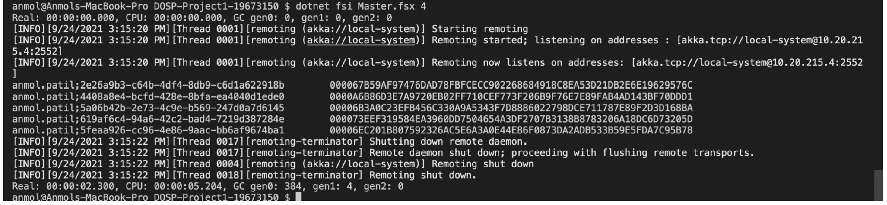

# Running a bitcoin miner on remote systems using Akka Actors

### Before running the scripts, the ip address of the machine needs to be edited in configuration of the server file(Master.fsx). The same ip needs to be used afterwards for further process.

* To run the server:
  * Command: 
    > dotnet fsi Master.fsx k
  * where k = 3,4,5...

* To run the workers:
  * Command: 
    > dotnet fsi Worker.fsx ipAddress
  * where ipAddress = ipAddress of the system where the server runs.

* Size of the Work Unit:
  * The worker gets a subproblem by randomly generating a UUID for itself once registered with master/server.
  For mining bitcoins the server generates input strings using the UUID generating function.
  For e.g.: ef606270-a10d-4da5-a594-273b040e4e43.
  The server starts working on this string and as workers keep spawning the functionality is distributed.

* The result for running the program for input 4
  > 

* Strings and mined bit coins of size 4: 
  * anmol.patil;2e26a9b3-c64b-4df4-8db9-c6d1a622918b **000067B59AF97476DAD78FBFCECC902268684918C8EA53D21DB2E6E19629576C**
  * anmol.patil;4408a8e4-bcfd-428e-8bfa-ea4040d1ede0 **0000A6B86D3E7A9720EB02FF710CEF773F206B9F76E7E89FAB4AD143BF70DDD1**
  * anmol.patil;5a06b42b-2e73-4c9e-b569-247d0a7d6145 **00006B3A0C23EFB456C330A9A5343F7D8886022798DCE711787E89F2D3D168BA**
  * anmol.patil;619af6c4-94a6-42c2-bad4-7219d387284e **000073EEF319584EA3960DD7504654A3DF2707B3138B8783206A18DC6D73205D**
  * anmol.patil;5feaa926-cc96-4e86-9aac-bb6af9674ba1 **00006EC201B807592326AC5E6A3A0E44E86F0873DA2ADB533B59E5FDA7C95B78**

* The running time for above size:
  * Calculations
    > CPU time = 5.204 seconds \
    > Real time = 2.3 seconds \
    > Ratio = (CPU time) / (Real time) = 5.204/2.3 = 2.26

* The coin with most 0's mined **00000005F405E7CDBC88EC9CA6E94BC5CDB2D38FA69CD02052F44492173736CE**

* The largest number of working machines I was able to run my code with:
  * The program is scalable. Maximum number of machines used to test scalability = 4. \
  * The configuration looks like this: \
    > **1** Server Node with **3** actors and **3** Worker Nodes with **4** actors each
    
* Bitcoins found:
  * anmol.patil;ef606270-a10d-4da5-a594-273b040e4e43 **00000005F405E7CDBC88EC9CA6E94BC5CDB2D38FA69CD02052F44492173736CE**
  * anmol.patil;eea53e29-193e-43a4-8a85-ee0b2a538e11 **0000004D1E6A1188BA98AF5804B3A1336683B239FC541867588C4E87AB932440**
